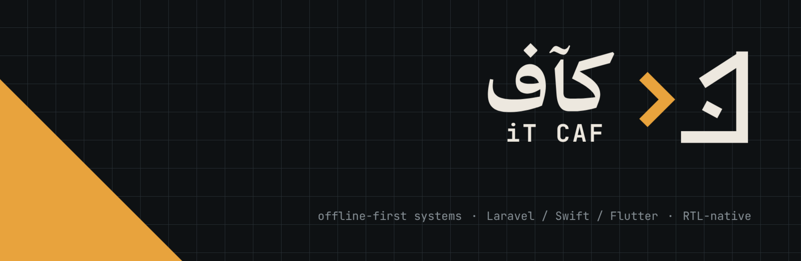

<p align="center">
  
</p>

<h3 align="right" dir="rtl">› أبني أنظمة تعمل بهدوء، وتصمد طويلًا.</h3>

<p align="right" dir="rtl">
مطوّر أنظمة ويب وجوّال: منصات حجز، أنظمة إدارة، وتطبيقات iOS — مصمّمة لتعمل دون اتصال، بواجهات عربية أصيلة، وكود يبقى مفهومًا بعد سنوات.
</p>

---

### `>` Run quietly.

I design **offline-first** systems that stay readable for years — booking platforms, management systems and iOS apps, built **RTL-first** for Arabic users.

```bash
$ itcaf --stack
# what I build with
backend   Laravel · PHP · MySQL
mobile    Swift · SwiftUI · Flutter
mode      "offline-first", "rtl-native"
locale    ar-SA · en   # RTL first
$ _
```

| `12+` | `2000` | `RTL` |
|:---:|:---:|:---:|
| systems in production · نظامًا في الإنتاج | offline users · مستخدم دون اتصال | first, always · أولًا، دائمًا |

### `<>` Selected work · مشاريع مختارة

- **bookings** — منصة حجز مواعيد مع تقويم هجري/ميلادي · `PHP`
- **carcast-ios** — CarPlay video app — AirPlay & browser · `Swift`
- **scan-ocr** — Text extraction with local vision models · `JavaScript`
- **exam-platform** — Timed exams, shared banks, random sets · `PHP`

### `{ }` Contact · تواصل

[it-caf.com](https://it-caf.com) · hello@it-caf.com

<p align="right"><sub><code>// build quietly</code> — كآف</sub></p>
