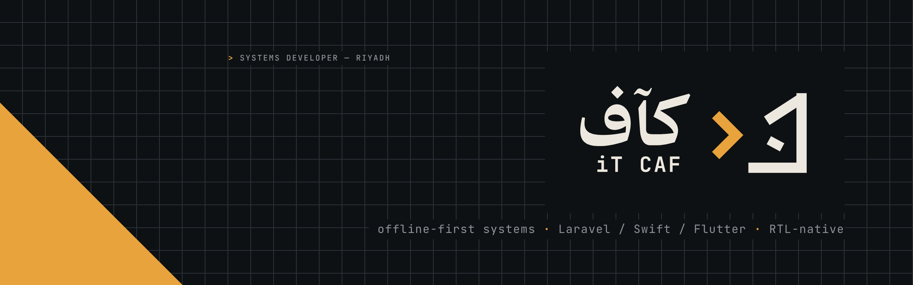
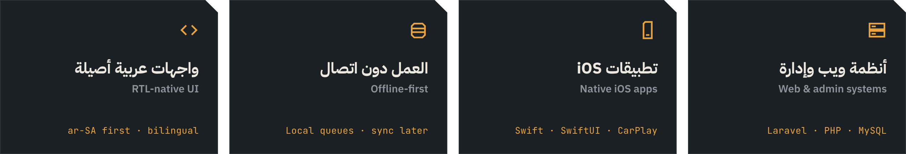
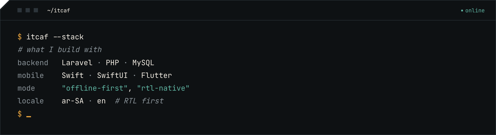

<picture>
  <source media="(prefers-color-scheme: dark)" srcset="assets/banner-dark.png">
  <source media="(prefers-color-scheme: light)" srcset="assets/banner-light.png">
  
</picture>

 

### ‹ أبني أنظمة تعمل بهدوء، وتصمد طويلًا.

مطوّر أنظمة ويب وجوّال من الرياض — منصّات حجز، أنظمة إدارة، وتطبيقات iOS.
أصمّمها لتعمل **دون اتصال**، بواجهات **عربية أصيلة**، وبكود يبقى مفهومًا بعد سنوات.

 

**`>` Run quietly.** I design offline-first systems that stay readable for years — booking platforms, management systems and native iOS apps, built RTL-first for Arabic users.

 

<picture>
  <source media="(prefers-color-scheme: dark)" srcset="assets/capabilities-dark.png">
  <source media="(prefers-color-scheme: light)" srcset="assets/capabilities-light.png">
  
</picture>

  

  

  
  
  
  
  
  
  

### `{ }` Contact · تواصل

  
  

 

<picture>
  <source media="(prefers-color-scheme: dark)" srcset="assets/footer-dark.png">
  <source media="(prefers-color-scheme: light)" srcset="assets/footer-light.png">
  
</picture>
